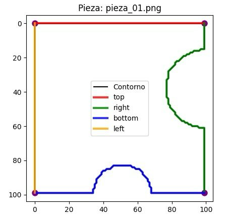

# Puzzle Solver Pipeline

This project automates the reconstruction of a jigsaw puzzle from a single photograph on a dark background. It comprises four main stages—segmentation, normalization, greedy solving, and composition—each exposed via both reusable functions and CLI scripts.

---

## 📦 Features

* **Piece Extraction**: Isolate each puzzle piece from a noisy background and output RGBA PNGs.
* **Orientation Normalization**: Rotate pieces to the nearest 90° multiple and trim transparent borders.
* **Greedy Assembly Solver**: Match contiguous borders using contour shape analysis and place pieces in a matrix.
* **Result Export**: Generate an assembled image and JSON summaries of placement, angles, and solver score.

---

## 🔨 Installation

**Clone the repository**:

   ```bash
   git clone https://github.com/nil443/jigsaw-solver.git
   ```

---

## 📁 Project Structure

```
├── in/
│   └── puzzle.png                # Input image of scattered pieces
├── pieces/                       # Segmented raw pieces
├── pieces_normalized/            # Oriented and cropped pieces
├── solution_greedy.png           # Assembled puzzle image
├── solution.json                 # Full solution data
├── info_pieces.json              # Initial positions & rotations
├── segment_pieces.py             # Segmentation module & CLI
├── normalize_pieces.py           # Normalization module & CLI
├── solve_puzzle_borders.py       # Greedy solver & CLI
└── main.py                       # Pipeline orchestrator
```

---

## 🚀 Usage

```bash
# 1. Extract pieces with optional debug overlay:
python segment_pieces.py -i in/puzzle.png -o pieces --save-debug

# 2. Normalize orientations:
python normalize_pieces.py -i pieces -o pieces_normalized

# 3. Solve with greedy border matching:
python solve_puzzle_borders.py -i pieces_normalized -o solution_greedy.png

# Orchestrate full pipeline end-to-end:
python main.py
```

Outputs:

* **solution\_greedy.png**: Final assembled image.
* **solution.json**: Contains:

  * `matrix`: placement grid of `(piece_index, rotation)` tuples
  * `positions`: original piece centers
  * `rotations_normalize`: angles applied during normalization
  * `rotations_total`: combined rotation for final placement
  * `score`: total mismatch metric from solver
* **info\_pieces.json**: `{ rotations: {...}, initial_positions: {...} }`

---

## ⚙️ Algorithm Details

### 1. Contour Extraction & Border Segmentation

* We detect each piece’s external contour via OpenCV’s `findContours` on a binary mask.
* Corners are approximated by selecting the 4-point subset with maximum pairwise distance.
* Borders (top, right, bottom, left) are traced as contiguous contour segments between successive corners.



### 2. Border Similarity Metrics. Border Similarity Metrics Border Similarity Metrics

For each side pair, we compute a two-component similarity:

1. **Curvature Difference**:

   * Resample each border to a fixed number of points (100).
   * Compute discrete curvature at each sample via angle changes over a sliding window.
   * L2-norm of curvature difference quantifies shape mismatch.

2. **Fourier Descriptors**:

   * Interpret border coordinates as complex values and take the FFT.
   * Extract the magnitudes of the first 20 non-zero frequencies, normalized to the first coefficient.
   * Euclidean distance between descriptor vectors captures global shape differences.

Combined mismatch for two borders is `||Δcurvature|| + ||ΔFD||`.

### 3. Greedy Placement Solver

* **Allowed Positions**: Precompute valid `(row, col, rotation)` triples for each piece by requiring:

  * Corner pieces: exactly two straight sides matching matrix corners.
  * Edge pieces: one straight side on outer border.
  * Interior: no straight sides.
* **Neighbor Offsets**: Four-directional offsets define adjacency.
* **Placement Loop**:

  1. Seed with the corner piece having the fewest valid placements.
  2. Iteratively fill each grid cell:

     * Iterate all unused pieces and rotations allowed at that position.
     * For each neighbor already placed, accumulate border-mismatch scores.
     * Select the piece/rotation with minimal total mismatch.
* **Score**: Sum of mismatch metrics across all shared borders.

---
